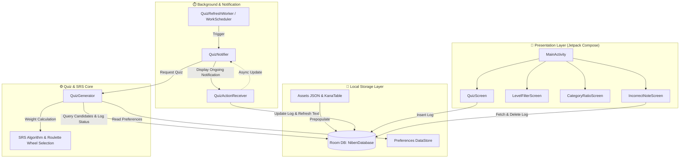

# 🌸 NiBen (にべん) — 오늘의 일본어 퀴즈 잠금화면 앱

<p align="center">
  
  
  
  
  
  
  
  
</p>

---

## 📌 1. 개요 (Overview)

**NiBen (にべん)** 은 스마트폰을 켤 때마다 잠금화면에서 바로 일본어 퀴즈를 풀며 학습할 수 있도록 설계된 **초경량 오프라인 일본어 퀴즈 애플리케이션**입니다.

서버 통신 없이 100% 기기 내에서 구동되며, 배터리와 메모리 소모를 극단적으로 최소화하면서 **"문제 노출 → 즉시 응답 → 실시간 채점 → SRS 기반 누적 학습"**의 퀴즈 루프를 제공합니다.

### 🎯 핵심 설계 원칙
- **Zero Network Overhead**: 완전한 로컬 구동(No Backend, No API Request). 네트워크 권한(`INTERNET`) 자체가 없습니다.
- **Lock-Screen Frictionless Interaction**: 잠금을 해제하지 않고도 상시 알림(Ongoing Notification)의 O / X 버튼을 통해 즉시 응답 및 실시간 채점.
- **Intelligent Spaced Repetition (SRS)**: 에빙하우스 망각 곡선 원리를 적용하여 취약 단어 및 미학습 단어를 지능적으로 우선 선별 출제.
- **Battery & Memory Optimization**: 저우선순위 알림 채널과 Android 표준 `WorkManager`를 채택하여 백그라운드 리소스 소모 최소화.

---

## ✨ 2. 주요 기능 (Key Features)

| 기능 분류 | 설명 |
|---|---|
| **🔒 잠금화면 OX 퀴즈** | 스마트폰 화면을 켜면 잠금화면에 상시 알림으로 문제가 표시되며, 알림 내 `O` / `X` 액션 버튼 클릭 시 `BroadcastReceiver`가 즉시 정답을 판정하고 알림 텍스트를 갱신합니다. |
| **📱 앱 내 선택형 퀴즈 (3지/4지선다)** | 알림 탭 시 `QuizScreen`으로 직접 진입하여 객관식 퀴즈를 풀 수 있으며, 선택 즉시 색상 피드백(초록/빨강) 및 퀴즈 로그를 기록합니다. |
| **🧠 간격 반복 시스템 (SRS)** | 미학습 단어 우선 가중치, 최근 오답 즉시/간격 복습 가중치, 최근 정답 감쇠 및 누적 오답 횟수를 결합한 룰렛 휠 가중 출제 알고리즘이 적용되어 있습니다. |
| **📝 오답노트 및 암기 완료 관리** | 자주 틀린 단어·문장과 오답 횟수를 확인하고, 복습 후 "외웠음" 버튼을 눌러 오답 이력을 초기화할 수 있습니다. |
| **📊 난이도 필터 (JLPT N5 ~ N1)** | Level 1(N5)부터 Level 5(N1)까지 원하는 난이도를 다중 선택하여 맞춤형 문제 풀이가 가능합니다. |
| **⚖️ 카테고리별 출제 비율 커스터마이징** | 히라가나, 가타카나, 한자, 단어, 문장의 5가지 카테고리별 출제 가중치(0~100)를 사용자가 직접 조절할 수 있습니다. |
| **⏰ WorkManager 자동 갱신** | 3시간마다 백그라운드에서 새로운 퀴즈 알림을 생성하며, 기기 재부팅(`BOOT_COMPLETED`) 후에도 스케줄이 유지됩니다. |

---

## 🏗️ 3. 시스템 아키텍처 & 동작 원리 (Architecture)



### 🧠 간격 반복(SRS) 가중치 계산 로직
`QuizGenerator.calculateSrsWeight()`에서 각 문항의 학습 이력을 분석하여 출제 가중치를 산출합니다:
- **미학습 문항 (`totalCount == 0`)**: 가중치 `+15.0` (신규 단어 우선 노출)
- **직전 풀이 오답**: 가중치 `+30.0` (오답 직후 최우선 복습)
- **오답 경과 시간 (2분 ~ 24시간 사이)**: 가중치 `+20.0` (에빙하우스 망각 곡선 대응)
- **직전 풀이 정답 (24시간 이내)**: 가중치 `2.0`으로 대폭 감쇠 (이미 암기한 단어 노출 주기 확대)
- **누적 오답 횟수**: `incorrectCount * 5.0` 누적 가산 (취약 항목 집중 학습)
- **최근 출제 문항 (최근 15개)**: 가중치 `0.0` (연속 중복 출제 방지)

---

## 📚 4. 내장 콘텐츠 데이터 (Bundled Content)

앱 내에 완전히 번들링되어 런타임 추가 다운로드 없이 최초 실행 시 Room DB에 자동 시딩(`ContentSeeder`)됩니다.

| 카테고리 | 데이터 소스 | 문항 수 | 설명 |
|---|---|:---:|---|
| **히라가나** | `KanaTable.kt` | 104개 | 청음(46) + 탁음(20) + 반탁음(5) + 요음(33) |
| **가타카나** | `KanaTable.kt` | 104개 | 청음(46) + 탁음(20) + 반탁음(5) + 요음(33) |
| **한자 (Kanji)** | `assets/kanji_seed.json` | 126자 | JLPT N5 수준 기초 한자 (음독/훈독/한글 뜻) |
| **단어 (Vocab)** | `assets/vocab_seed.json` | 151개 | N5 기초 어휘 및 여행/생활 필수 단어 (인사, 숫자, 교통 등) |
| **문장 (Sentence)** | `assets/sentence_seed.json` | 151개 | 여행/회화 필수 표현 (공항, 숙소, 식당, 쇼핑, 길찾기 등) |

---

## 🛠️ 5. 기술 스택 (Tech Stack)

### Development Environment & SDK
- **Language**: Kotlin `2.0.20`
- **Compile SDK**: `34` (Android 14)
- **Target SDK**: `34` (Android 14)
- **Min SDK**: `26` (Android 8.0 Oreo)
- **Java Target**: Java 17

### Core Libraries & Frameworks
- **UI Framework**: [Jetpack Compose](https://developer.android.com/jetpack/compose) (Material 3, Compose BOM `2024.09.00`)
- **Database**: [Room](https://developer.android.com/training/data-storage/room) `2.6.1` (with KSP code generation)
- **Asynchronous & Concurrency**: Kotlin Coroutines & Flow
- **Background Scheduling**: [WorkManager](https://developer.android.com/topic/libraries/architecture/workmanager) `2.9.1`
- **Key-Value Storage**: [Jetpack DataStore Preferences](https://developer.android.com/topic/libraries/architecture/datastore) `1.1.1`
- **System Services**: Android NotificationManager, `BroadcastReceiver`

---

## 📂 6. 디렉토리 구조 (Project Structure)

```
com.niben.app
├── MainActivity.kt               # 메인 화면 진입점 및 화면 간 전환 관리
├── NibenApplication.kt          # 앱 초기화, 데이터 시딩, WorkManager 등록, 알림 채널 생성
├── data/                         # 로컬 데이터 영속성 계층
│   ├── CategoryRatioStore.kt    # 카테고리별 가중치 Preferences DataStore
│   ├── ContentCategory.kt       # 카테고리 Enum (HIRAGANA, KATAKANA, KANJI, VOCAB, SENTENCE)
│   ├── ContentDao.kt            # 문제 조회 및 통계 JOIN 쿼리 DAO
│   ├── ContentItem.kt           # 콘텐츠 Room 엔티티
│   ├── ContentSeeder.kt         # 번들 에셋 JSON 및 가나 테이블 DB 초기 시딩
│   ├── IncorrectItem.kt         # 오답 통계 DTO
│   ├── ItemWithLogStatus.kt     # 단어 정보 + 퀴즈 로그 통계 결합 DTO
│   ├── KanaTable.kt             # 히라가나/가타카나 104쌍 하드코딩 테이블
│   ├── LevelFilterStore.kt      # 난이도 필터 Preferences DataStore
│   ├── NibenDatabase.kt         # Room Database 정의
│   ├── QuizLog.kt               # 퀴즈 풀이 이력 Room 엔티티
│   ├── QuizLogDao.kt            # 오답 조회 및 퀴즈 로그 처리 DAO
│   ├── QuizType.kt              # 퀴즈 유형 Enum (OX, THREE_CHOICE, FOUR_CHOICE)
│   └── RecentItemsStore.kt      # 최근 출제 ID(최대 15개) 저장소
├── notification/                 # 알림 및 잠금화면 인터랙션
│   ├── QuizActionReceiver.kt    # 잠금화면 알림 액션(O/X) 비동기 채점 리시버
│   └── QuizNotifier.kt          # NotificationChannel 생성 및 상시 알림 노출/갱신
├── quiz/                         # 퀴즈 생성 및 알고리즘
│   └── QuizGenerator.kt         # OX/선택형 퀴즈 생성 및 SRS 가중치 룰렛 휠 선택
├── ui/                           # Jetpack Compose UI 화면
│   ├── CategoryRatioScreen.kt   # 카테고리별 출제 비율 조절 화면
│   ├── IncorrectNoteScreen.kt   # 오답노트 확인 및 암기 완료 처리 화면
│   ├── LevelFilterScreen.kt     # JLPT 난이도 다중 선택 화면
│   └── QuizScreen.kt            # 앱 내 객관식 퀴즈 풀이 화면
└── work/                         # 백그라운드 주기 작업
    ├── QuizRefreshWorker.kt     # 3시간 주기 퀴즈 갱신 CoroutineWorker
    └── WorkScheduler.kt         # WorkManager 주기 작업 등록
```

---

## 🚀 7. 빌드 및 설치 가이드 (Build & Installation)

### 1) 요구 사항
- Android Studio Ladybug (2024.2.1) 이상 권장
- JDK 17 이상
- Android 8.0 (API Level 26) 이상의 안드로이드 물리 기기

### 2) 클론 및 빌드
```bash
# 저장소 클론
git clone https://github.com/peter9889466/NiBen.git
cd NiBen

# 디버그 APK 빌드 (Windows PowerShell)
.\gradlew.bat assembleDebug

# 연결된 실기기에 직접 설치
.\gradlew.bat installDebug
```

### 3) 실기기 테스트 및 권한 설정
1. **USB 디버깅 활성화**: 폰의 `설정 → 휴대전화 정보 → 빌드 번호`를 7회 탭하여 개발자 옵션을 켠 후, `USB 디버깅`을 활성화합니다.
2. **알림 권한 허용**: Android 13(API 33) 이상 기기에서는 앱 최초 실행 시 표시되는 `알림 권한(POST_NOTIFICATIONS)` 요청을 허용합니다.
3. **잠금화면 알림 표시 확인**: 기기 설정에서 `잠금화면 → 알림 표시` 옵션이 켜져 있는지 확인합니다.

---

## 📄 8. 라이선스 및 크레딧 (License)

본 프로젝트는 개인 학습용으로 제작된 오픈소스 프로젝트입니다.
- **히라가나/가타카나/단어/한자/문장 데이터**: 수기 큐레이션 및 커스텀 번들링
- 코드는 자유롭게 학습 및 수정 목적으로 사용하실 수 있습니다.
